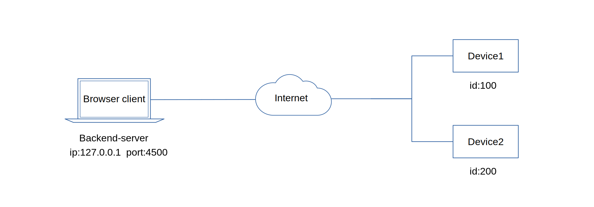

# Node-M2M Web Application Demo Using A Browser Client


[](https://raw.githubusercontent.com/EdoLabs/src2/master/quicktour4.svg?sanitize=true)

<!-- This is a quick demo on how to integrate *m2m* into your web application project. -->

This demo consists of a simple front-end consisting of an *m2m client*, a back-end server using *nodejs* and *express* along with the two remote devices. 

The browser *m2m client* will directly access and capture resources from the two remote devices - device1 and device2.

The back-end server can be hosted from any platform - Linux, Windows or Mac. 

The back-end serves a static *index.html* file and the *node-m2m.min.js* library file from the public folder using localhost(127.0.0.1) and port 4500.

You will need to get a web access token to authenticate your browser client with node-m2m to secure your browser application. To get a web access token, login to node-m2m, click the menu icon, then go to security section to finally generate your web access token.    

The two remote devices ideally should be Raspberry Pi devices. However, as an alternative if they are not available, you can just use any x64 computers - Linux or Windows and set GPIO in simulation mode.

<br>

## Option1 - Using a Raspberry Pi device with an led actuator

On both devices, install an led actuator on pin 33 and 35.

#### Remote Device1

Install a switch button on pin 11.

##### 1. Create a device project directory and install *m2m* and *array-gpio*.
```js
$ npm install m2m array-gpio
```
##### 2. Save the code below as *device.js* in your device project directory.

```js
const { Device } = require('m2m');

let device = new Device(100);

let myData = 'myData';

device.connect('https://www.node-m2m.com', () => {

  device.setGpio({mode:'input', pin:[11, 13]}, (gpio) => console.log('input pin', gpio.pin, 'state', gpio.state));
  device.setGpio({mode:'output', pin:[33, 35]}, (gpio) => console.log('output pin', gpio.pin, 'state', gpio.state));

  device.dataSource('get-data', (data) => {
    data.send(myData);
  });

  device.dataSource('send-data', (data) => {
    if(data.payload){
      myData = data.payload;
      data.send(data.payload);
    }
  });

  // error listener
  device.on('error', (err) => console.log('error:', err))
});
```
##### 3. Start your device application.
```js
$ node device.js
```
#### Remote Device2

##### 1. Create a device project directory and install *m2m* and *array-gpio*.
```js
$ npm install m2m array-gpio
```
##### 2. Save the code below as *device.js* in your device project directory.

```js
const { Device } = require('m2m');

const device = new Device(200);

device.connect('https://www.node-m2m.com', () => {

  device.setGpio({mode:'input', pin:[11, 13]}, (gpio) => console.log('input pin', gpio.pin, 'state', gpio.state));
  device.setGpio({mode:'output', pin:[33, 35]}, (gpio) => console.log('output pin', gpio.pin, 'state', gpio.state));
  
  device.publish('random-number', (data) => {
    let r = Math.floor(Math.random() * 100) + 25;
    data.send(r);
    console.log('random', r);
  });
    
  // error listener
  device.on('error', (err) => console.log('error:', err));
  
});
```
##### 3. Start your device application.
```js
$ node device.js
```
<br>

## Option2 - Using Windows or Linux as remote devices
#### Remote Device1

Here, you don't need to install the array-gpio module but instead the gpio resources will run in simulation mode.

##### 1. Create a device project directory and install *m2m*.
```js
$ npm install m2m
```
##### 2. Save the code below as *device.js* in your device project directory.

```js
const { Device } = require('m2m');

let device = new Device(100);

let myData = 'myData';

device.connect('https://www.node-m2m.com', () => {

  device.setGpio({mode:'input', pin:[11, 13], type:'simulation'}, (gpio) => console.log('input pin', gpio.pin, 'state', gpio.state));
  device.setGpio({mode:'output', pin:[33, 35], type:'simulation'}, (gpio) => console.log('output pin', gpio.pin, 'state', gpio.state));

  device.dataSource('get-data', (data) => {
    data.send(myData);
  });

  device.dataSource('send-data', (data) => {
    if(data.payload){
      myData = data.payload;
      data.send(data.payload);
    }
  });

  // error listener
  device.on('error', (err) => console.log('error:', err))
});
```
##### 3. Start your device application.
```js
$ node device.js
```
#### Remote Device2

##### 1. Create a device project directory and install *m2m*.
```js
$ npm install m2m
```
##### 2. Save the code below as *device.js* in your device project directory.

```js
const { Device } = require('m2m');

const device = new Device(200);

device.connect('https://www.node-m2m.com', () => {

  device.setGpio({mode:'input', pin:[11, 13], type:'simulation'}, (gpio) => console.log('input pin', gpio.pin, 'state', gpio.state));
  device.setGpio({mode:'output', pin:[33, 35], type:'simulation'}, (gpio) => console.log('output pin', gpio.pin, 'state', gpio.state));
    
  device.publish('random-number', (data) => {
    let r = Math.floor(Math.random() * 100) + 25;
    data.send(r);
    console.log('random', r);
  });
  
  // error listener
  device.on('error', (err) => console.log('error:', err));
  
});
```
##### 3. Start your device application.
```js
$ node device.js
```

<br>

## Web Application Setup

##### 1. Click the link below to create an access token.
[Create Access Token for Browser Client.](https://github.com/EdAlegrid/m2m-api#create-an-access-token-for-browser-client)

##### 2. Download the *m2m-browser-client-demo* project from *GitHub*.
```js
$ git clone https://github.com/EdAlegrid/m2m-browser-client-demo.git
```
##### 3. Install all dependencies inside *m2m-browser-client-demo* directory.
```js
$ cd m2m-browser-client-demo
```
```js
$ npm install
```
##### 4. Replace the access token in your index.html file.

Replace the acces token from the `script` section of your `/m2m-browser-client-demo/public/index.html` file. 
```js
<script>

// Replace the tkn below with your actual access token. Protect your access token at all times.  
var tkn = 'fce454138116159a6ad9a4234e7de810a1087fa9e7fbfda74503d9f52616fc5';

var client = new NodeM2M.Client();

client.connect(tkn, () => {

  ...

});  
```
##### 5. Start the web application server.
```js
$ node app
```
##### 6. Open a browser tab.
`http://127.0.0.1:4500`

The web application page should show the various sections with control buttons to try out how *m2m* communicates with the remote devices to control gpio outputs and access data.


